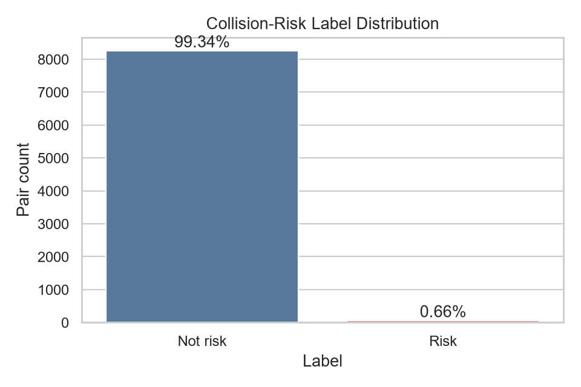
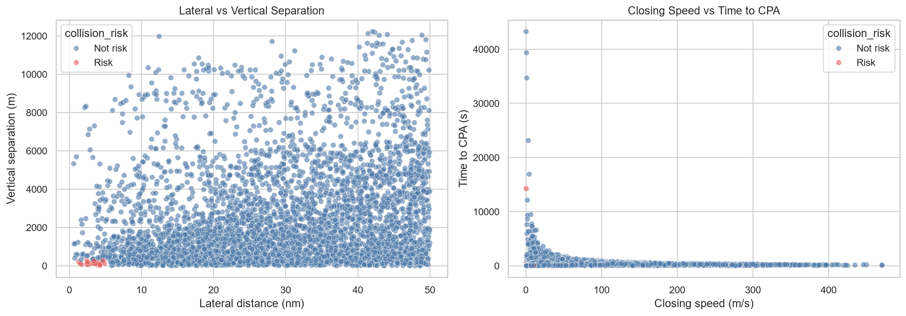
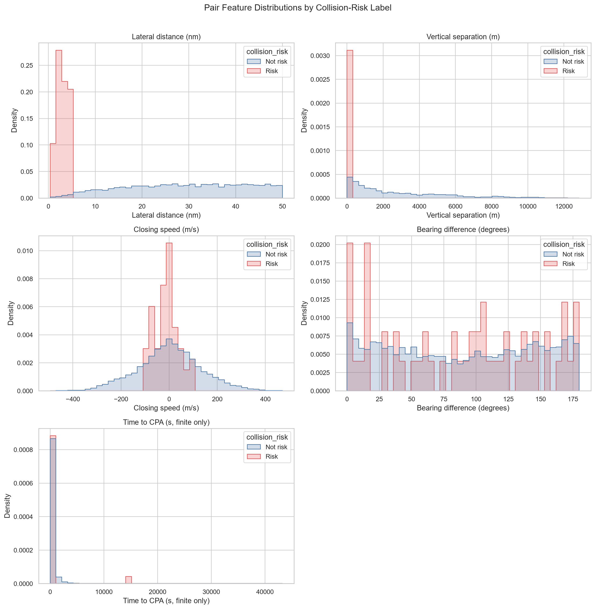
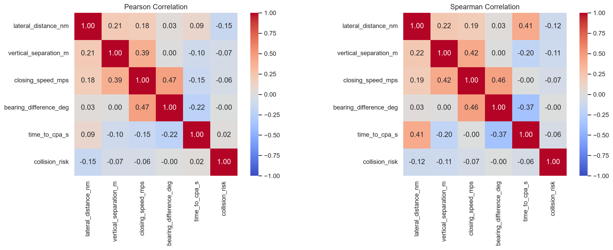
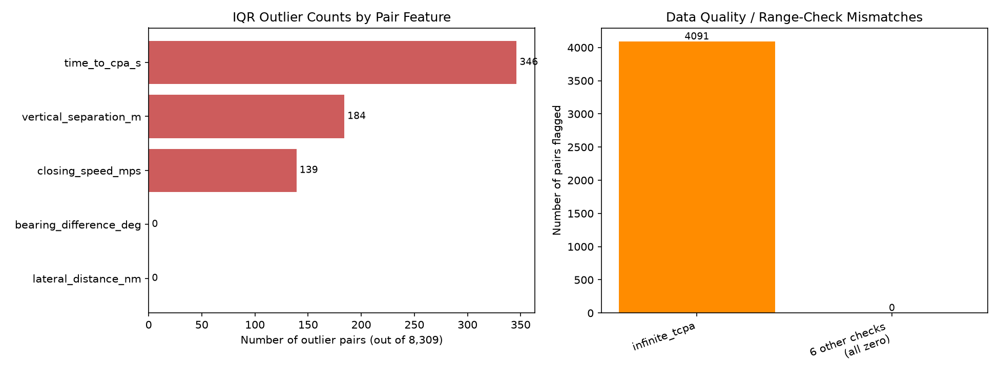
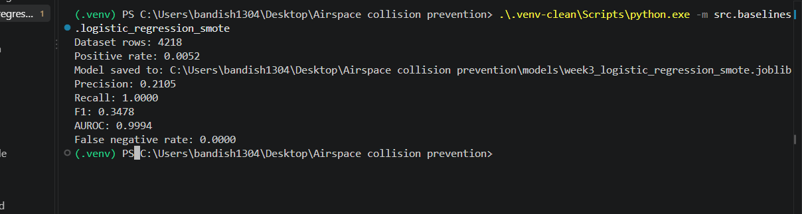
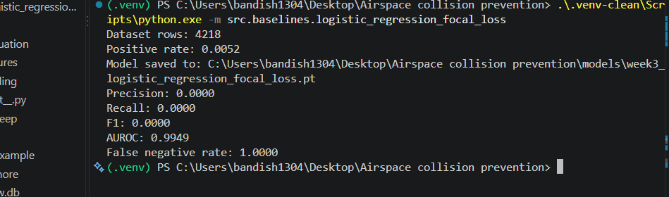

# Airspace Collision Risk Prediction

## Abstract

This project investigates whether machine-learning models can identify potential aircraft-pair collision risk from Automatic Dependent Surveillance-Broadcast (ADS-B) telemetry. The research focuses on Southern California airspace and is designed to compare a graph neural network baseline with a Temporal Fusion Transformer (TFT) once sufficient historical trajectory data has been collected.

The study first examined imbalance-aware classification strategies for the rare collision-risk event, and then extended the workflow to graph-based representations of aircraft interactions. The work in this phase was designed to evaluate how class imbalance affects safety-critical detection and to ensure that the later graph formulation preserves the same collision-risk signals used in the base feature pipeline.

## Section I
### Introduction

Mid-air collision prevention is a safety-critical prediction problem with two important characteristics. First, risk belongs to a relationship between two aircraft rather than to one aircraft in isolation. Second, a possible conflict develops over time: distance, altitude, heading, speed, and the projected point of closest approach must be considered together.
This project therefore represents aircraft as interacting entities and creates features for aircraft pairs that are geographically close. The longer-term research goal is to compare two model families:

- A graph neural network (GNN) that represents aircraft as nodes and nearby aircraft pairs as edges.
- A Temporal Fusion Transformer (TFT) that uses sequences of pair features over time.

The imbalance analysis identified the most reliable strategy for a highly skewed collision-risk label, and the subsequent graph formulation translated the same kinematic features into a spatial representation suitable for modeling aircraft interaction patterns.This stage was important because collision-risk prediction is a safety problem, so the model selection process needed to balance recall, precision, and the cost of false negatives rather than relying only on aggregate accuracy.

## Section II
### Related Work

The project builds on a data pipeline that combines ADS-B state information, pairwise feature engineering, and rule-based labeling for collision-risk detection. A structured exploratory analysis was used to assess class imbalance, feature quality, and the suitability of the generated pair features for downstream modeling.

This section reflects the practical work carried out to select a more robust classification strategy and to convert the same pairwise signals into a graph representation that better captures aircraft-to-aircraft interaction.The methodology compared baseline performance under different imbalance-handling strategies to select the most suitable approach for collision-risk detection, and then transformed aircraft snapshots into graphs where nodes represent aircraft and edges encode proximity and interaction features.

## Section III
### Proposed Methodology

#### Dataset description and Preprocessing
The proposed methodology begins with ADS-B state-vector data collected from the OpenSky Network. In the beginning the data-ingestion process was established fothe Southern California study area, and the available fields, units, and data
quality issues were documented. NTSB accident records were collected separately for background context.

##### Feature Engineering
There was also the methodology converted individual aircraft observations into aircraft pairs within 50 nautical miles. For each pair, the pipeline calculates horizontal distance, closing speed, bearing difference, vertical separation,and time to the closest point of approach. Ground aircraft and stale position
reports are filtered before pair construction. Each pair is assigned a rule-based Risk label when the lateral separation is at most 5 nautical miles and the vertical separation is at most 1,000 feet. The final step is exploratory analysis of class balance, missing values, invalid values, outliers, correlations, and label leakage. This methodology establishes the data-processing foundation for future temporal modeling, but historical snapshots are still required before training a GNN or TFT model.

The methodology prioritised imbalance-aware evaluation and then represented aircraft as interacting nodes with edge attributes that reflect distance, closing speed, and time-to-CPA. This setup supports graph-based learning without changing the original modeling foundation already described in the file.The graph construction step was designed to preserve the key collision-risk cues from the pair-feature pipeline while adding the relational structure needed for a graph neural network baseline.

## Section IV
### Results and Discussion

The processed dataset contains 8,309 aircraft pairs, including 8,254 pairs labeled Not risk (99.338%) and 55 pairs labeled Risk (0.662%) using the separation rule. The exploratory analysis found no missing values or invalid pair measurements, but identified outliers in vertical separation, closing speed, and time to CPA. These results validate the initial pipeline, although the single-snapshot dataset is not yet sufficient for temporal model training.

The findings showed that the class imbalance required careful metric selection, and the graph construction confirmed that proximity-based edges preserve the key collision-risk signals in a format suitable for GNN learning.These results show that the work completed in this phase was not only preparing the data for modeling, but also validating that the graph representation retained the features most relevant to identifying risky aircraft encounters.

#### Collision-Risk Class Distribution

#### Pair-Feature Relationships

The class-distribution figure shows that the dataset contains far more Not risk pairs than Risk pairs, which will require imbalance-aware evaluation in later weeks. The relationship plots provide an initial view of how aircraft separation and movement-related features vary across the generated pairs.

#### Pair-Feature Distributions by Label

Splitting each feature by label makes the class imbalance easier to see in context: risk pairs cluster tightly at low lateral distance and low vertical separation, while not-risk pairs spread across the full range of both features. This separation is a big part of why the rule-based label is learnable at all despite being so rare.

#### Pair-Feature Correlations

Both the Pearson and Spearman correlation heatmaps show that no single feature is strongly correlated with the collision-risk label on its own, which is expected for a rule that combines lateral and vertical separation jointly rather than relying on one variable. Closing speed and bearing difference show a moderate relationship with each other, which reflects how aircraft heading and closing behavior are physically linked.

#### Outlier and Data-Quality Mismatches

The outlier check found no invalid pairs for lateral distance or bearing difference, but flagged 346 pairs for time to CPA, 184 for vertical separation, and 139 for closing speed using the IQR rule. Separately, the range-check pass found no negative distances, no out-of-range bearings, and no duplicate pairs, with the only notable mismatch being 4,091 pairs where time to CPA was infinite because the aircraft were on non-converging paths. This distinction matters because it separates genuine data-quality problems, of which there were none, from expected physical outcomes like a pair that will never reach closest approach.

#### SMOTE Training Run

#### Focal Loss Training Run

#### MLflow Experiment Runs

The SMOTE run reached a recall of 1.0 and an AUROC of 0.9994, while the focal loss run reached an AUROC of 0.9949 but a recall of 0.0, missing every risk case in that run. The MLflow runs view shows all eight logged experiments for the imbalance study, which made it straightforward to compare strategies side by side before selecting SMOTE as the strategy to carry forward.

## Section V
### Conclusion
### (More to come...)
